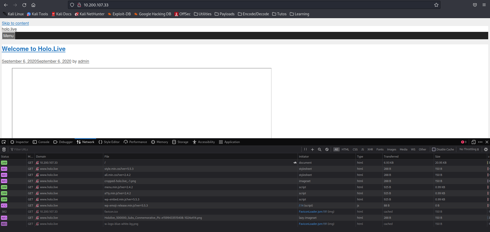

## Task 1-7
Intro to the challenge

## Task 8
Skip port scan in nmap
```
$ nmap -sn -v 10.200.*.* 
Nmap done: 65536 IP addresses (4 hosts up) scanned in 4135.57 seconds
CTRL + SHIFT + F Host is up
10.200.0.0
10.200.107.250
10.200.107.33 (web server)
10.200.0.7
```
```
$ nmap -sV -sC -p- 10.200.107.30 10.200.107.250 10.200.0.7
```

## Task 9
#### Q1: What domains loads images on the first web page?


Answer is *www.holo.live*

#### Q2: What are the two other domains present on the web server? Format: Alphabetical Order
```
$ ffuf -w /usr/share/wordlists/SecLists/Discovery/DNS/subdomains-top1million-110000.txt -u http://10.200.107.33 -H "Host: FUZZ.holo.live"  --fs 21456


        /'___\  /'___\           /'___\       
       /\ \__/ /\ \__/  __  __  /\ \__/       
       \ \ ,__\\ \ ,__\/\ \/\ \ \ \ ,__\      
        \ \ \_/ \ \ \_/\ \ \_\ \ \ \ \_/      
         \ \_\   \ \_\  \ \____/  \ \_\       
          \/_/    \/_/   \/___/    \/_/       

       v1.5.0 Kali Exclusive <3
________________________________________________

 :: Method           : GET
 :: URL              : http://10.200.107.33
 :: Wordlist         : FUZZ: /usr/share/wordlists/SecLists/Discovery/DNS/subdomains-top1million-110000.txt
 :: Header           : Host: FUZZ.holo.live
 :: Follow redirects : false
 :: Calibration      : false
 :: Timeout          : 10
 :: Threads          : 40
 :: Matcher          : Response status: 200,204,301,302,307,401,403,405,500
 :: Filter           : Response size: 21456
________________________________________________

admin                   [Status: 200, Size: 1845, Words: 453, Lines: 76, Duration: 2571ms]
dev                     [Status: 200, Size: 7515, Words: 639, Lines: 272, Duration: 4614ms]
www.www                 [Status: 301, Size: 0, Words: 1, Lines: 1, Duration: 256ms]
```
So we got our answer *admin, dev*

## Task 10
#### Q1: What file leaks the web server's current directory?
You can notice in the nmap scan that we did for the website the file robots.txt.


So the answer is *robots.txt*

#### Q2: What file loads images for the development domain?
Visiting the main page, we find no information about a file loading images.
Going through the website, we visit the talent page. We capture in burpsuite requests as
```
GET /img.php?xxxx.png
```
So the answer is *img.php*

#### Q3: What is the full path of the credentials file on the administrator domain?
Looks like the devs really like that robots.txt file.. :


Answer: */var/www/admin/supersecretdir/creds.txt*

## Task 12
#### Q1:What file is vulnerable to LFI on the development domain?
Since we found out that file img.php loads images to the site, its a good place to start testing for LFI.
We attempt to modify the values of parameter *file* and we get a result
[Holo](/imgs/task12_lfi.png)

#### Q2: What parameter in the file is vulnerable to LFI?
Answer is *file*

#### Q3: What file found from the information leak returns an HTTP error code 403 on the administrator domain?
Answer is */var/www/admin/supersecretdir/creds.txt*

#### Q4: Using LFI on the development domain read the above file. What are the credentials found from the file?
We just input the name of this file to the *file* parameter, we get the answer

## Task 13
#### Q1: What file is vulnerable to RCE on the administrator domain?
#### Q2: What parameter is vulnerable to RCE on the administrator domain?
#### Q3: What user is the web server running as?


